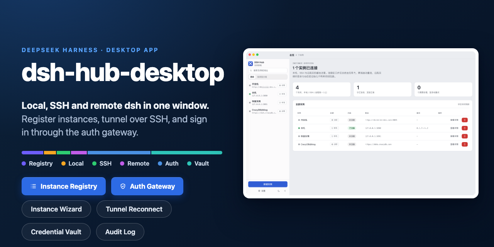
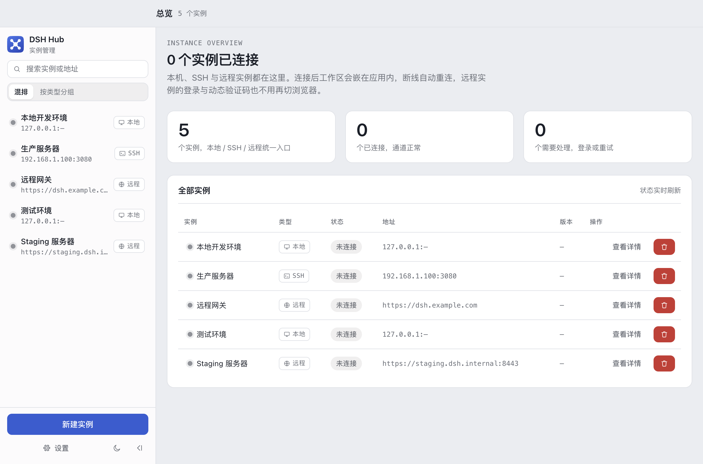
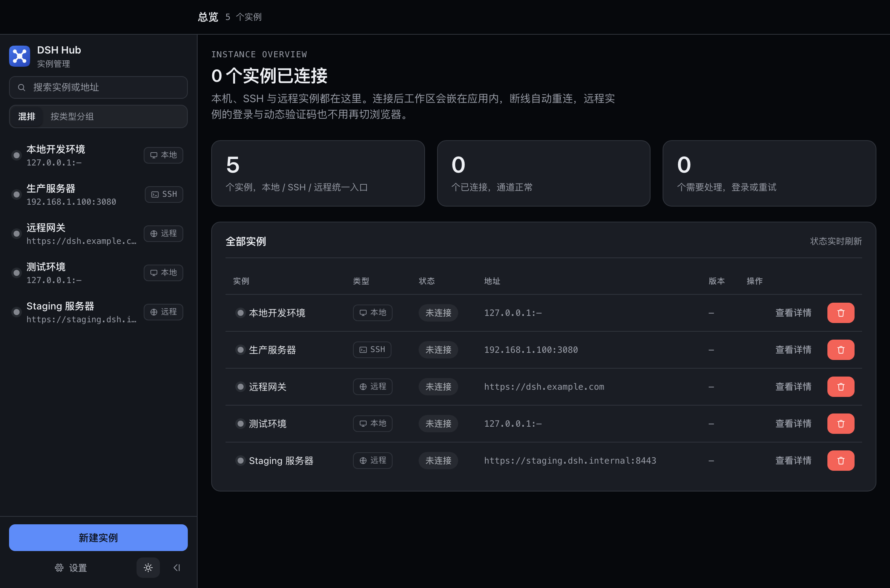
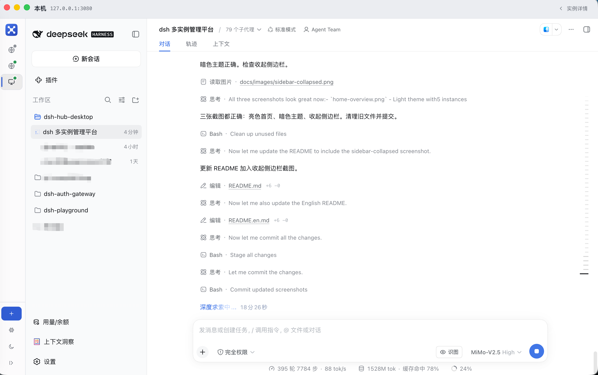
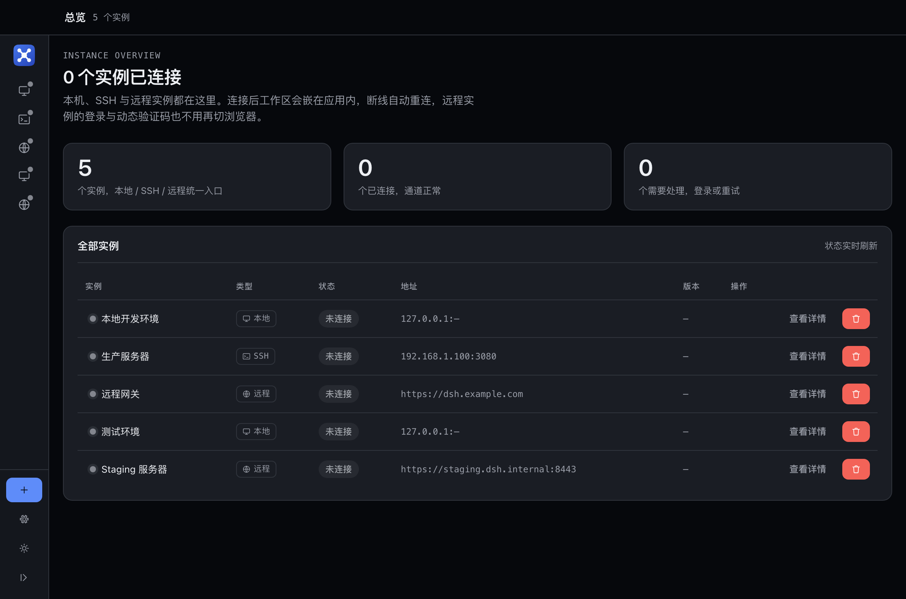

# DSH Hub Desktop

[中文](README.md)



> A personal side project. Mainly solves the problem of constantly switching between documentation pages and `dsh` pages when working on remote development machines.
> My `OpenCode-go` and `mimo-code-plan` were both about to expire, so I designed a prototype with OpenDesign and implemented it using `dsh` — and `DSH Hub` was born.
> Total `dsh` usage: 395 rounds, 7,784 steps, 1,528M tokens.

A personal Electron desktop tool for managing multiple **dsh** (DeepSeek Harness) instances — local processes, SSH tunnels, and remote HTTP connections, all in one place. Authentication integrates with the dsh-auth-gateway protocol (password + TOTP + HttpOnly Cookie injection), with a credential vault for silent login using saved passwords.

Since I don't have an Apple Developer Account, I can't distribute a signed app. You'll need to `clone` the repo and build with `pnpm dist:mac`.

## Features

- **Unified Instance Management**: Local registry with atomic writes, rolling backups, corruption recovery, and schema migration. Wizard-based creation → startup → detail page for start/stop/edit/open/delete
- **Three Transport Types**: Unified status channel with transport-specific dispatch
  - `local`: Spawn local processes
  - `ssh`: Tunnels with exponential backoff watchdog for auto-reconnection
  - `http/https`: Remote direct connection
- **Integrated Authentication**: Gateway five-state detection (login page / OTP / onboarding / API 401 / no auth required). Auth panel with full state flow (password → 6-digit OTP / backup codes → lockout countdown). **Silent login with saved passwords** (after checking "Remember password", no re-entry needed on restart/session expiry — passwords never cross process boundaries)
- **WebView Integration**: Partitioned cookie injection (inject before loadURL), 302/401 request interception, session expiry signal-driven re-authentication
- **Credential Vault**: System keychain (safeStorage), opt-in only (unchecked by default); instant clear on uncheck/forget
- **Audit Log**: Whitelist projection, credentials never stored
- **SSH Security**: TOFU host fingerprint verification (trust on first use / reject on change), passwords passed via ephemeral memory channel
- **Bilingual + Light/Dark Theme**: Full zh/en i18n (lint guardrails prevent omissions), OKLch brand tokens
- **Tray / Notifications / Auto-start**: Configurable

| | |
|:---:|:---:|
|  |  |
| *Light Theme · Instance Overview* | *Dark Theme · Instance Overview* |
|  |  |
| *Instance Detail Page* | *Collapsed Sidebar · Icon Mode* |

## Tech Stack

| Layer | Choice |
|-------|--------|
| Desktop Framework | Electron 43 + electron-vite 5 + Vite 7 |
| UI | React 18 + zustand + hand-written CSS (OKLch light/dark themes) |
| Language | TypeScript 5.9 (strict + `noUncheckedIndexedAccess`) |
| Validation | zod 4.6.5 (sole runtime dependency) |
| Testing | Vitest 4 (unit) · Playwright `_electron` (E2E) · Contract tests (against real gateway) |
| Toolchain | ESLint 9 flat + Prettier 3 · pnpm 11 · Node 22 |

> Vite 8 / TypeScript 7 / React 19 are intentionally avoided (per version line review — do not upgrade).

## Architecture

```
src/
├─ shared/          Framework-agnostic core (shared between node + web, never imports electron)
│  ├─ endpoint.ts   URL parsing/normalization (protocol-first, host:port disambiguation, IPv6, loopback detection)
│  ├─ contracts.ts  Instance model (zod discriminated unions) + IPC channel constants + IpcResult envelope + schema migration
│  ├─ settings.ts   Non-sensitive preferences (language/theme/tray/auto-start/notifications)
│  ├─ i18n/         Flat key → {zh,en} message catalog
│  └─ bridge.ts     Preload bridge interface types + app channel constants
├─ main/            Main process (single location for all electron globals)
│  ├─ index.ts      Window / app://hub protocol + CSP / assembly
│  ├─ ipc/register.ts  All ipcMain.handle registrations; input zod validation → error envelope
│  ├─ registry/     Instance registry: atomic write + backup + recovery + migration
│  ├─ transport/    Local spawn / SSH tunnel / HTTP direct connection
│  ├─ auth/         Gateway client + auth state machine + session restoration + silent login
│  ├─ webview/      Partitioned cookie injection, request interception, view planning
│  ├─ vault/        Credential vault (keychain, explicit opt-in)
│  ├─ audit/        Audit log (whitelist projection)
│  └─ shell/        Tray / native settings / notifications (injectable implementation)
├─ preload/         contextBridge whitelist, only exposes dshHub.*
└─ renderer/        React shell + views · zustand store · i18n guardrails
tests/e2e/          Playwright _electron
tests/upgrade/      Upgrade path and release metadata guardrails
scripts/release/    Release rehearsal and checksums
design/             UI visual baseline (HTML prototype) + brand tokens
```

**Core Design Conventions** (see `AGENTS.md` for details):

- **IPC Envelope**: All channels return `{ok:true,value} | {ok:false,code,message}` with stable error codes; renderer maps codes to messages. New channels follow a fixed four-step process (contracts → register → bridge/preload → tests)
- **Framework-Agnostic Core**: shared / registry / transport / auth / vault / audit never import electron
- **Instance Model**: `transport: local|ssh|http` × `authMode: auto|none|gateway`; transport is immutable after creation

## Quick Start

Prerequisites: Node 22+, pnpm 11.

```bash
pnpm install
pnpm dev            # Start dev server + Electron window
```

In restricted/sandboxed environments, install requires additional parameters (pnpm store and electron cache must target writable directories):

```bash
pnpm install --store-dir=/tmp/pnpm-store --cache-dir=/tmp/pnpm-cache
ELECTRON_CACHE=/tmp/electron-cache node node_modules/electron/install.js  # If postinstall is skipped
```

## Common Commands

| Command | Description |
|---------|-------------|
| `pnpm dev` | Dev server + Electron window |
| `pnpm typecheck` | Type check node + web + e2e projects |
| `pnpm lint` | ESLint (flat config) |
| `pnpm test` | Unit tests (vitest) |
| `pnpm build` | Build all three targets (required before E2E) |
| `pnpm test:e2e` | Playwright `_electron` tests |
| `pnpm test:contract` | Auth contract tests against local dsh-auth-gateway source; requires `DSH_AUTH_GATEWAY_SRC=/path/to/dsh-auth-gateway` |

**Testing notes**: E2E cases use an isolated temp directory via `DSH_HUB_DATA_DIR`; instances and credentials are synthetic data constructed in the test environment. CI failure artifacts include only Playwright error contexts, traces, UI screenshots, and audit logs; the credential vault file (`vault/credentials.json`) is never uploaded, even though its contents are ciphertext. If a future test must pre-seed vault data, it must use mock data constructed in the test environment and document its construction here.

Release commands fall into two categories: "local packaging & verification" and "source release." The current GitHub Release uses a `source-only` strategy — only source code, tags, and Release Notes are published. No `.app`, `.dmg`, `.zip`, `.exe`, auto-update metadata, or checksum files are uploaded. Users must prepare their own build environment and build from source.

Local packaging commands are retained, but the unsigned, notarized artifacts are only suitable for development, local verification, and controlled testing:

```bash
pnpm dist:mac:zip      # macOS zip, for local verification
pnpm dist:mac          # Generate unsigned macOS .app, for local verification
pnpm dist:win          # Windows NSIS, for local verification
pnpm release:checksums # Local byte checksum helper
pnpm release:check     # Source-only release rehearsal, does not check dist/ artifacts
```

Before an official source release, run `CI=true pnpm release:check -- --pre` and confirm the release notes include the `source-only` distribution mode. The release closure command creates only a tag and a draft Release without assets; see [`docs/release-policy.md`](docs/release-policy.md). Before resuming official binary distribution, Apple Developer ID signing, notarization, clean-machine verification, and auditable update metadata checksums are required.

> In non-TTY environments, `pnpm <script>` requires `CI=true` (pnpm 11 dependency checks abort without a TTY).

## Data Directory

- Runtime data: `<userData>/` (overridable via `DSH_HUB_DATA_DIR` environment variable);
  Instance registry at `<userData>/registry/instances.json`
- In-repo `hub-data/` is for local runs / E2E data (gitignored; E2E auto-isolates to `hub-data/e2e*`)

## Security & Credential Discipline

- Registry / audit / logs / documentation **never store** passwords, OTPs, cookies, or private keys;
  passwords and OTPs are only passed ephemerally via IPC parameters and reside in memory
- Vault writes require **explicit user opt-in** (unchecked by default); degraded mode (keychain unavailable) never persists to disk
- Audit records are constructed via whitelist projection (object spread prohibited), structurally preventing credential leaks
- SSH host key TOFU: trust on first fingerprint confirmation, **reject on any fingerprint change**;
  recovery requires explicit forgetting of that host fingerprint
- When silent login uses a saved vault password, the password never crosses process boundaries: the main process retrieves it directly, with no read-back channel to the renderer

## Documentation

- Product, design, and release strategy (committed):
  `docs/PRD.md` · `docs/dsh-hub-desktop-design.md` ·
  `docs/desktop-implementation-plan.md` · [`docs/release-policy.md`](docs/release-policy.md) ·
  `design/dsh-hub-desktop.html` · `design/brand-spec.md`
- Task tracking documents (dev task lists, review reports, delivery checklists, packaging/release rehearsals, security audit reports, etc.)
  are **local documents**, organized by milestone in `docs/local/ms-<N>/` (currently `ms-1`), excluded from git
  (one-time task tracking; see `.gitignore`)
- Repository-level development rules: `AGENTS.md`
