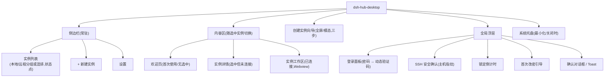
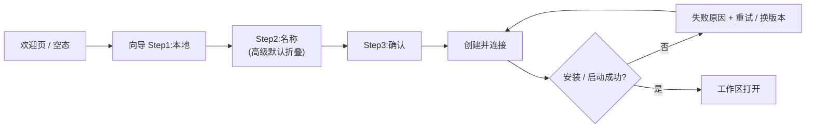
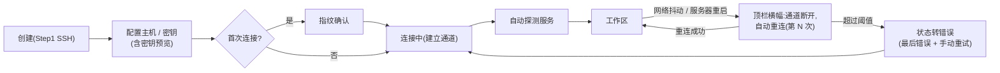
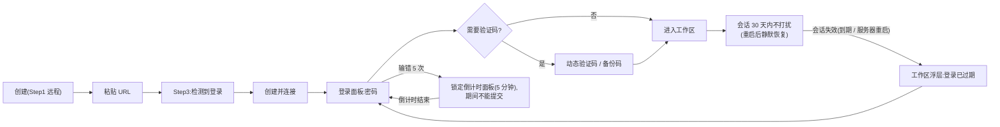
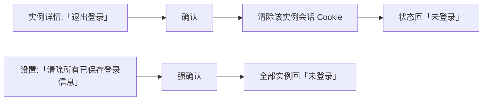
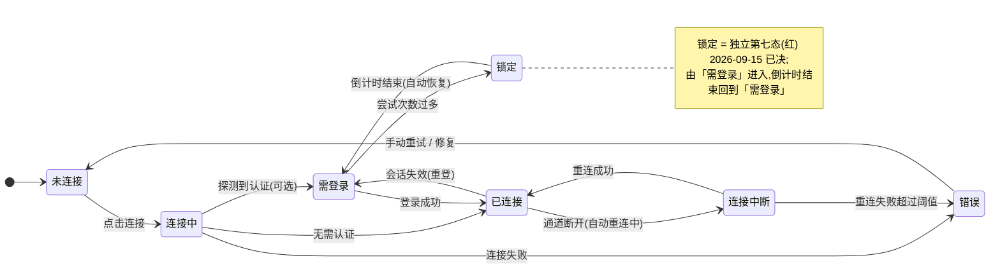

# dsh-hub-desktop 产品需求文档(PRD)

| 项 | 内容 |
|---|---|
| 文档版本 | v0.1(评审稿) |
| 面向读者 | 产品、UI/UX 设计、研发(设计为主要读者) |
| 关联文档 | `docs/dsh-hub-desktop-design.md`(架构与技术契约,设计按需查阅附录) |
| 平台 | macOS / Windows(Electron 桌面应用,遵循原生桌面惯例) |

---

## 1. 产品概述

### 1.1 一句话定位

**一个装在本地电脑上的 dsh 实例管理中心:把本机、远程服务器上的所有 DeepSeek Harness(dsh)实例统一管理,点一下就连上;远程实例带密码 + 动态验证码(2FA)双重认证。**

### 1.2 要解决的痛点

| 现状 | 痛点 |
|---|---|
| 每台机器各自装一个 dsh,浏览器里开一个 `localhost:3080` | 多个环境(日常开发/插件测试/版本尝鲜)互相干扰,没有统一入口 |
| 服务器上的 dsh 只能靠 `ssh -L` 端口转发 + 手动敲命令 | 隧道断了要手动重连,没有状态可视化,容易忘记关端口 |
| 带认证的远程实例(密码 + TOTP)目前只能靠浏览器登录页 | 浏览器操作繁琐、会话过期后要重新扫码/输入,桌面端完全没有集成经验 |
| 需要一个"登录态管理"心智 | 密码、验证码、会话过期、锁定倒计时分散在各处,用户无感知 |

### 1.3 核心价值(对用户的三句话)

1. **一个入口管所有**:本机实例、服务器实例,同一个侧边栏里点开即用;
2. **连接自己会恢复**:SSH 隧道断线自动重连,状态一眼可见,不需要再碰命令行;
3. **认证体验一体化**:远程实例的密码、动态验证码、首次改密、锁定倒计时,全部在应用内完成,会话保持 30 天,失效自动弹窗重登。

### 1.4 目标用户

- **多环境开发者**:同时维护日常开发、插件测试、版本尝鲜多个本地实例;
- **远程开发机用户**:在服务器(systemd 守护的 headless dsh)上跑长任务,笔记本随时接回;
- **安全敏感用户**:远程实例必须经过密码 + TOTP 二次验证才可访问。

### 1.5 非目标(首版明确不做)

- 不做多人/多租户隔离(单用户工具);
- 不做手机端应用(手机连桌面是另一个方向,不在本产品范围);
- 不取代 dsh 自身的 Web UI——所有工作都发生在嵌入的 dsh 界面里,hub 只负责"连接与认证";

---

## 2. 产品概念与术语(设计师必读)

### 2.1 实例(Instance)

**"实例"= 一个可连接的 dsh 运行环境。** 用户只需要理解:侧边栏里每一行就是一个实例,点"连接"就能进入它的界面。实例分三种来源:

| 实例类型 | 用户视角 | 一句话 |
|---|---|---|
| 本地实例 | 装在本机的 | "在自己电脑上跑的 dsh" |
| SSH 实例 | 通过 SSH 隧道连服务器上的 | "用 SSH 安全通道接上服务器里的 dsh,就像它在本地一样" |
| 远程实例 | 直接填网址连的 | "输入服务器的网址(和登录密码)直接连接" |

### 2.2 认证(Auth)

远程实例可能有登录门禁(密码 + 动态验证码)。应用中所有认证交互都在**认证面板**里完成,用户不需要知道底层是网关插件。

### 2.3 术语表(界面文案避免使用技术黑话;以下为内部理解)

| 术语 | 含义 | 对用户展示建议 |
|---|---|---|
| 实例 Instance | 一个 dsh 运行环境 | 「实例」(如:开发-日常 / 服务器-主力) |
| 传输方式 | 本地 / SSH / 远程直连 | 「连接方式」 |
| 认证 / 2FA | 密码 + 动态验证码 | 「登录」「动态验证码」「备份码」 |
| DSH_HOME / profile | 实例的数据与配置目录 | 不在界面强展示,高级设置可展开 |
| 会话(Session) | 登录后的有效状态(30 天) | 「登录状态」 |
| 锁定 | 多次输错后的临时封禁(5 分钟) | 「尝试次数过多,已暂时锁定,xx 秒后可重试」 |
| 隧道(Tunnel) | SSH 建立的本地↔服务器通道 | 「连接通道」「加密通道」 |
| Webview | 内嵌的 dsh 网页界面 | 「工作区」(承载 dsh 界面的区域) |

---

## 3. 信息架构与导航

### 3.1 IA 结构



### 3.2 导航规则

- 侧边栏**常驻**,任何页面可一键回到实例列表;
- 每个已连接实例打开独立**窗口**(首版)——侧边栏 + 工作区窗口双形态(详见开放问题 OQ-1);
- 新建向导三步,支持返回修改,最后一步有完整确认。

---

## 4. 页面与交互需求

> 每页给出:目的 / 布局 / 关键元素 / 交互 / 状态 / 设计注意点。**状态小节是设计师重点**,连接类产品 80% 的界面细节在状态与反馈里。

---

### 4.1 主界面:实例工作台(首页)

**目的**:全部实例的总览与唯一操作入口。

**布局建议**:

```
┌──────────┬────────────────────────────────┐
│ 实例列表  │  内容区                         │
│          │  · 未选中:欢迎/总览             │
│ ┌──────┐ │  · 已选中:实例详情              │
│ │状态点 │ │  · 已连接:工作区               │
│ │ 名称  │ │                                │
│ └──────┘ │                                │
│ [+ 新建] │                                │
│ 设置     │                                │
└──────────┴────────────────────────────────┘
```

**关键元素与交互**:

| 元素 | 说明 | 状态/交互 |
|---|---|---|
| 实例行 | 图标、名称、类型徽标(本地/SSH/远程)、状态点、健康摘要 | 单击选中;双击/点击"连接"进入工作区 |
| 状态点 | 颜色语义:灰=未连接;蓝=连接中;绿=已连接;**黄=认证需要处理(需登录/锁定中)**;红=错误 | 悬停显示状态详情 |
| 新建按钮 | 常驻,进入三步向导 | 快捷键 ⌘N |
| 分组 | 按类型分组或混排(可切换),分组名可折叠 | — |
| 空状态 | 无实例:插画 + 文案 + 「新建第一个实例」按钮 | 引导式空态 |

**状态(列表行)**:

| 状态 | 行内表达 | 可操作 |
|---|---|---|
| 未连接 | 灰点 + 「未连接」 | 连接 / 编辑 / 删除 |
| 连接中 | 蓝点(可选呼吸动效)+ 「连接中…」 | 取消 |
| 需认证 | 黄点 + 「需要登录」 | 打开登录面板 |
| 已连接 | 绿点 + 会话时长/「已连接」 | 打开工作区 / 断开 |
| 错误 | 红点 + 原因摘要(如「通道断开,自动重连中」) | 重试 / 查看详情 |
| 锁定 | 黄/红点 + 「已锁定,xx:xx 后可重试」 | 查看倒计时 |

**设计注意**:状态语义必须一致(见 §7);类型徽标用小色块/图标差异,不要依赖颜色(色盲友好)。**已定(2026-09-15)**:主界面采用**表格形态**(列:实例/类型/状态/地址/版本/操作,见设计稿 `view-home`),替代本节的列表行方案——信息密度更高,与"工具类应用"定位一致。

---

### 4.2 创建实例向导(三步)

**目的**:引导用户 1 分钟创建一个可连接的实例。

**Step 1 — 选择连接方式**(卡片选择):

| 卡片 | 主文案 | 副文案 |
|---|---|---|
| 本地实例 | 在此电脑上运行 | 适合日常开发、插件测试、版本尝鲜,自动安装 dsh 版本 |
| SSH 服务器 | 通过加密通道连接服务器 | 连接服务器上已在运行的 dsh,断线自动重连 |
| 远程网址 | 直接连接远程地址 | 输入带登录认证的实例网址(支持动态验证码) |

**Step 2 — 传输配置**(按类型切换表单):
- 本地:实例名称 → (高级:版本、数据目录、端口,默认折叠);
- SSH:昵称、主机(或 ssh 别名)、SSH 端口、用户名、认证方式(密钥/密码,密钥路径选择);
  - **密钥预览(增强)**:输入主机后自动展示「将使用哪个密钥」——读取本机 ssh-agent 与默认密钥/别名配置,只读提示(如 `将使用密钥:ed25519(agent)` / `未检测到可用密钥,请在系统设置中启动 ssh-agent`);密钥内容绝不展示、不进应用存储;支持「使用别名配置的密钥」折叠收起;
- 远程:名称、网址(自动识别是否带登录,识别结果在 Step 3 展示)。

**Step 3 — 认证与确认**:
- 展示"我们将自动检测是否需要登录"或检测结果(`已检测到登录认证`);
- 可选凭据策略:「记住登录状态」/「记住密码」(默认都不勾,文案说明安全差异);
- 确认卡片:名称、连接方式、地址摘要、数据目录摘要 →「创建并连接」。

**设计注意**:Step 2/3 的"高级"信息默认折叠;远程网址输入框带**自动粘贴识别**(粘贴完整 URL 自动解析);每步有示例输入与格式校验错误提示。

---

### 4.3 实例详情页

**目的**:连接前了解实例,连接后管理实例。

**内容模块**:
- 顶部:名称、类型徽标、状态、主操作按钮(连接/断开/重试)、菜单(编辑/删除);
- 连接方式卡片:地址、隧道端口、安全提示(如「未加密连接」警告);
- 认证卡片:是否启用双因素、登录状态(已登录/未登录/已锁定)、「登录」「退出登录」「清除已保存的登录信息」;
- 运行信息(本地/SSH):版本、运行时长、日志入口、磁盘占用;
- 审计记录入口:该实例的连接与登录事件时间线。

**设计注意**:信息按"连接 / 认证 / 运行 / 记录"四组卡片排布,自上而下信息密度递增;删除操作必须二次确认(输入实例名或长按确认)。

---

### 4.4 实例工作区(核心页面)

**目的**:用户在 dsh 界面里干活的地方。hub 只提供外壳:顶栏/状态栏 + 全屏 dsh 网页。

**布局**:

```
┌─────────────────────────────────────────┐
│ 顶栏:实例名 · 连接状态 · [断开] [在新窗口打开] │
├─────────────────────────────────────────┤
│                                         │
│        dsh Web UI(嵌入,占据全部空间)       │
│                                         │
├─────────────────────────────────────────┤
│ 认证浮层(需要登录时出现,可拖动)            │
└─────────────────────────────────────────┘
```

**交互规则**:
- 顶栏极简,不喧宾夺主;连接状态变化时顶栏给一次性 Toast + 状态色;
- 连接中断(SSH 断线):**不打断工作**,顶栏横幅提示「通道断开,正在自动重连…」,重连成功后横幅消失,页面自动恢复;
- 会话失效(需要重新登录):**顶部浮层化**——dsh 页面可见但被遮罩提示「登录已过期」+「重新登录」按钮,避免用户误以为 dsh 坏了;
- 认证浮层(登录面板)在浮层内完成全部步骤,不新开窗口。

**设计注意**:这是用户 90% 时间停留的页面,框架感要弱、沉浸感要强;顶栏与遮罩样式需与 dsh 界面(亮/暗主题)协调,建议跟随 dsh 主题联动。

---

### 4.5 登录与二次验证面板

**目的**:远程实例认证的一站式交互。**这是本产品差异化最强的界面,设计优先级最高。**

**形态**:模态面板(可拖动的小窗),在实例工作区上方浮动;或独立小窗。

**流程状态(顺序推进)**:

| 步骤 | 界面内容 | 备注 |
|---|---|---|
| 1. 输入密码 | 实例名 + 「此实例需要登录」+ 密码框 + [记住密码(勾选)] | 回车提交 |
| 2. 动态验证码 | 「请输入动态验证码」+ 6 位验证码输入框(大字号、自动聚焦、粘贴友好)+ 切换「使用备份码」 | 密码正确后进入;或密码+验证码一次提交(见下方"自适应") |
| 2'. 备份码 | 8 位备份码输入框 | 认证器不可用时 |
| 3. 登录成功 | 成功动效(轻量)+ 自动关闭 | 淡出 |
| 失败 | 统一文案「用户名或密码/验证码错误」+ 输错次提示 | **不区分具体哪步错**(安全要求) |
| 锁定 | 「尝试次数过多,已锁定 N 分 N 秒」+ 倒计时 + 禁用提交 | 倒计时结束自动恢复 |

**自适应设计要点**:
- 面板**自动检测**是否需要验证码:需要则密码页后跟验证码页;不需要则密码页直接进;
- **分步是唯一形态**(password → otp → backup,逐步提问),**不提供密码+验证码同屏输入**——协议虽支持单请求提交,但对 UX 无增益,还多一个密码框常驻状态(已决 2026-09-15);
- **已存密码直达验证码(已决 2026-09-15)**:检测到钥匙串已存密码(用户曾勾选「记住密码」)时,面板**跳过密码屏**,密码静默随请求提交,用户只填 6 位验证码;静默提交失败(401 统一错误)→ 回退密码屏并提示,不暴露"密码错还是验证码错";已存密码**不因失败自动清除**(锁定风险),引导用户到详情/设置主动清除;
- 支持**密码管理器/钥匙串**自动填充视觉(「记住登录状态」勾选后下次静默恢复,面板不再出现);
- 敏感输入:验证码大字号居中、整行;密码框标准安全样式;面板内不显示任何明文凭据回顾。

**设计注意**:锁定倒计时要**可见、可理解、不可操作**(按钮置灰 + 倒计时数字);错误文案统一映射表见 §8.3(严禁暴露"密码错还是验证码错")。

---

### 4.6 首次改密引导(Onboarding)

**目的**:远程实例首次部署使用初始密码,系统强制要求设置个人密码。

**界面**:全屏/占位引导(遮罩工作区),两步:
1. 说明:「此实例正在使用初始密码,请设置你的个人密码」;
2. 表单:初始密码(预填或手动)、新密码、确认新密码,含强度提示(≥8 位,需大小写或特殊字符)。

完成后自动用新密码登录并进入工作区。**设计注意**:与登录面板同视觉语言,但更"正式"——这是信任建立时刻,文案与插画可增强安全感。

---

### 4.7 SSH 安全确认(主机指纹)

**目的**:首次连接 SSH 服务器时,向用户展示并确认服务器身份(防中间人攻击)。

**界面**:模态对话框:

```
连接安全确认
「server.example.com」是首次连接,请核对指纹:
SHA256:AbC1…XyZ9
[我的服务器,信任并连接]  [取消]
```

**设计注意**:极简、信息明确;指纹展示可复制;「不再询问(仅信任此设备)」不默认勾选;指纹变化时(已信任主机出现不同指纹)对话框改为红色警示态,仅提供「取消」与「我已确认(高级)」。

---

### 4.8 设置页

**分组**:
- 通用:语言(中文/English)、关闭到托盘、开机自启、主题(跟随系统/浅/深);
- 数据:数据目录位置(展示+打开)、实例数据清理(清除所有已保存登录/清除全部实例);
- 关于:版本、更新检查、「查看审计日志」入口。

**设计注意**:设置页低频使用,保持克制;危险操作(清数据)红色语义 + 二次确认。

---

### 4.9 系统托盘

- 常驻图标:空闲/有连接活动(可选状态下标);
- 菜单:「打开 DSH Hub」「运行中的实例」子菜单(每项:名称 + 打开/断开)、「退出」;
- 关闭窗口 → 默认到托盘(可在设置关);退出时**必须确认**(正在运行的实例会一并断开);
- 事件通知:SSH 断线重连成功/失败、会话过期、登录锁定,发系统通知(可设置关闭)。

---

## 5. 核心用户流程(设计评审用旅程图)

### 5.1 本地实例:创建 → 连接(≈1 分钟)



欢迎页/空态 → 新建向导 Step1(本地)→ Step2(名称,高级默认折叠)→ Step3 确认 →「创建并连接」→ 进度(安装/启动)→ 工作区打开。安装进度需要可视(步骤 + 百分比),支持失败重试(「安装失败,原因:…」+ 重试/换版本)。

### 5.2 SSH 实例:连接 → 断线 → 自动恢复



创建(Step1 SSH)→ 配置主机/密钥 → 首次连接弹指纹确认 → 连接中(建立通道)→ 自动探测服务 → 工作区。运行中:服务器重启/网络抖动 → 顶栏横幅「通道断开,自动重连中(第 N 次)」→ 恢复后横幅自动消失 + 轻通知。连续失败超过阈值 → 状态转错误,展示最后错误与手动重试。

### 5.3 远程实例 + 双因素:完整认证旅程



创建(Step1 远程)→ 粘贴 URL → Step3 检测到登录 → 创建并连接 → 登录面板:密码 →(自动)动态验证码 → 成功进入。会话 30 天内不再打扰;重启应用后静默恢复(若勾选记住登录态)。到期/服务器重启(会话失效)→ 工作区浮层「登录已过期」→ 重新登录(同上流程)。输错 5 次 → 锁定倒计时面板(5 分钟),期间不能提交。

### 5.4 登出与清除



实例详情「退出登录」→ 确认 → 该实例会话 Cookie 清除 → 状态回「未登录」。设置页「清除所有已保存登录信息」→ 强确认 → 全部回未登录。

---

## 6. 状态与反馈设计规范(给设计)

### 6.1 实例状态机(用户可见 6 态)



| 状态 | 颜色语义 | 图标建议 | 动效建议 |
|---|---|---|---|
| 未连接 | 灰 | 圆点/开关 | 无 |
| 连接中 | 蓝 | 圆点 | 呼吸/转圈(轻) |
| 需登录 | 琥珀/黄 | 圆点+钥匙 | 无 |
| 已连接 | 绿 | 实心圆点 | 无(稳定) |
| 连接中断(重连中) | 琥珀(横幅) | 连接图标+箭头 | 横幅滑动进入/淡出 |
| 错误 | 红 | 圆点+警示 | 无 |
| 锁定 | 红(--danger,独立第七态,已决 2026-09-15) | 挂锁 | 倒计时数字跳动(仅秒位) |

**规则**:状态色全应用统一 token;不能只靠颜色(辅以图标/文案);动效克制(重连动画不打扰工作区操作)。

### 6.2 反馈分级

| 级别 | 形态 | 场景 |
|---|---|---|
| 信息 | Toast(2.5s)/状态横幅 | 重连成功、登录成功、静默恢复 |
| 进行中 | 内联进度/步骤条 | 安装、连接、登录提交中 |
| 警告 | 横幅(可关闭,常驻) | 通道断开重连中、未加密连接提示 |
| 错误 | 状态行/红色 Toast + 详情入口 | 连接失败、登录失败、锁定 |
| 破坏性操作 | 确认对话框(红色主按钮) | 删除实例、清除所有登录、退出(有运行中实例) |

### 6.3 空态/加载态/错误态规范

- **空态**:插画 + 一句话 + 主行动按钮(新建实例);
- **加载态**:列表骨架屏;向导提交按钮内联 loading;工作区加载 = 顶部细进度条(不遮挡 dsh 页面);
- **错误态**:每处错误必须给「原因摘要 + 可执行动作(重试/去设置/查看日志)」,禁止只有「出错了」。

---

## 7. 视觉与品牌方向(供设计发挥,非硬约束)

| 项 | 方向建议 |
|---|---|
| 平台惯例 | macOS 统一工具条/毛玻璃窗口;Windows 跟随系统 TitleBar 或自定义(二选一,一致性优先) |
| 主题 | 跟随系统明/暗;工作区与 dsh 主题联动;品牌主色建议 DeepSeek 深蓝系,状态色遵循 §6.1 |
| 布局 | 侧边栏 240–280px 可拖宽;内容区密度中;列表行 48–56px |
| 字体 | 系统字体栈(中文 PingFang SC / Microsoft YaHei);验证码等宽数字字体 |
| 图标 | 线性图标(1.5px 笔画),状态图标与实例类型图标区别化 |
| 圆角/阴影 | 面板 8–12px;浮层阴影分层(登录面板 > 对话框 > 横幅) |
| 动效 | 150–250ms 缓动;重连/心跳类动效 ≤ 1s 周期,可关闭(系统「减弱动态效果」尊重) |
| 无障碍 | 正文对比度 ≥ 4.5:1;全键盘可达(焦点环明显);表单有 label;错误不只靠颜色 |

---

## 8. 文案与国际化

### 8.1 语言
中文为主,英文同步(设计产出需兼顾两种语言文本长度差异:最长文案按中文 1.4 倍行宽预留)。

### 8.2 文案原则
- 动词开头、结果导向:「创建并连接」而非「确认」;
- 不暴露技术黑话(见 §2.3 术语表映射);
- 错误文案给原因 + 行动,不给「Error 500」;
- 安全类文案(锁定/指纹/清除)用正式语气,普通操作用轻松语气。

### 8.3 错误文案统一表(认证类,设计师建立视觉形式的文案中心)

| 场景 | 文案(中) | 级别 |
|---|---|---|
| 凭据错误 | 「账号或验证码错误,请重试(还剩 N 次机会)」 | 错误 |
| 需要验证码 | 「请输入动态验证码(或使用备份码)」 | 信息 |
| 全局限流 | 「尝试过于频繁,请 30 秒后重试」 | 警告 |
| 锁定 | 「尝试次数过多,已锁定 4:32,结束后自动恢复」 | 错误 |
| 会话过期 | 「登录已过期,请重新登录」 | 警告 |
| 首次改密 | 「此实例正在使用初始密码,请先设置个人密码」 | 信息 |
| 指纹(新) | 「首次连接,请确认服务器指纹」 | 信息 |
| 指纹(变化) | 「服务器指纹与已信任的不一致,请确认后连接」 | 错误 |

---

## 9. 体验指标(非功能)

| 指标 | 目标 |
|---|---|
| 应用启动到可用 | ≤ 3s |
| 实例列表刷新 | ≤ 500ms(本地感知) |
| 连接操作反馈(点击→状态变化) | ≤ 1s |
| 登录提交反馈 | ≤ 1s(受网络影响,提交态必须立即出现) |
| SSH 断线自动重连恢复 | ≤ 30s(视觉提示 1s 内出现) |
| 登录成功后进入工作区 | ≤ 3s |
| 崩溃/退出 | 无孤儿进程;重启后可恢复实例列表(含备份) |

---

## 10. 设计交付物清单(给设计团队)

1. **信息架构与导航稿**(§3 展开)
2. **全部页面稿**:主界面、向导 3 步(3 种实例)、详情、工作区(含顶栏/遮罩)、登录面板全状态、首次改密、指纹确认、设置、托盘菜单
3. **状态图**:§6.1 六态 × 列表行/详情/工作区三处落地
4. **认证面板状态流转稿**:密码→验证码→成功/失败/锁定(含 2FA 自适应两种路径)
5. **组件规范**:状态点、类型徽标、横幅/Toast/浮层层级、按钮等级、输入框(含验证码大字号)、空态插画
6. **明暗双主题** token 表(颜色/圆角/阴影/间距)
7. **图标集**:实例类型(本地/SSH/远程)、状态、认证(密码/验证码/锁定)、托盘
8. **文案表**:§8 全量文案中英对照
9. **原型交互说明**:关键流程(§5)逐帧标注

---

## 11. 开放问题(需产品/设计共同决策)

| 编号 | 问题 | 现状建议 |
|---|---|---|
| OQ-1 | 工作区形态:多窗口(首版)vs 页签容器 | 设计先行评估:若页签方案在交互上明显更优,可提升为首版(实现成本 +2d) |
| OQ-2 | 登录面板形态:浮层(工作区上方)vs 独立小窗 | 浮层(沉浸);听取设计意见 |
| OQ-3 | 侧边栏分组:按类型分组 vs 混排可排序 | 混排 + 分组开关;听取设计意见 |
| OQ-4 | 品牌命名与图标方向 | **已定:项目名保留 `dsh-hub-desktop`**(个人自用项目,不对外发布;虽有 `dsh-desktop-hub`(FlashingChen)等近似名,不构成实际冲突)。图标方向仍待定(hub 意象:集线器/聚合) |
| OQ-5 | 首次启动引导:欢迎页 vs 直接空态 | 欢迎页(含安全说明);听取设计意见 |
| OQ-6 | 断线重连的打扰度 | 默认横幅 + 收进顶栏状态;进阶可「仅图标 + 通知」,设置项 |

---

## 12. 附录:与本 PRD 对应的技术承接

- 架构、协议契约、实现计划见 `docs/dsh-hub-desktop-design.md` 与 `docs/desktop-implementation-plan.md`(设计无需阅读,研发按此实施);
- 本 PRD 页面/状态/流程若与设计文档冲突,**以 PRD 为准**并回写设计文档。