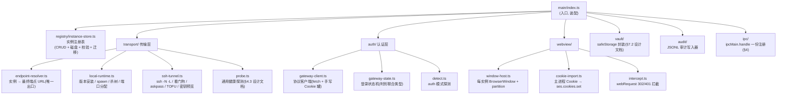

# dsh-hub-desktop 桌面端实现计划

> 承接 [`docs/dsh-hub-desktop-design.md`](./dsh-hub-desktop-design.md)(架构与协议契约)。本文给出**可执行**的实现方案:技术栈定版、仓库引导、模块图与生命周期、IPC 契约、每个模块的实现要点、里程碑→任务分解(每任务含验收与验证)。
>
> 状态:待评审 · 评审通过前不写代码

---

## 1. 技术栈定版

| 层 | 选型 | 版本线 | 说明 |
|---|---|---|---|
| 外壳 | Electron | ≥ 31(LTS) | Cookie 注入/拦截能力(选型论证见设计文档 §3.1) |
| 构建 | electron-vite | 2.x | 主/预加载/渲染三端统一 Vite 构建,`npm create @quick-start/electron` 模板 |
| 语言 | TypeScript | 5.x,strict | 共享契约类型 `shared/contracts.ts` |
| UI 框架 | React 18 + Ant Design 5 | — | 表单/向导/表格成熟;生态与 dsh-launcher(Arco)同为国内社区 |
| 状态 | zustand | 4.x | 渲染进程侧实例/状态/设置 store |
| 路由 | react-router | 6.x | 实例列表 / 向导 / 详情 / 设置 |
| i18n | react-i18next | — | zh / en,扁平 JSON |
| 校验 | zod | 3.x | **所有 IPC 输入在边界校验**(api-and-interface-design 原则) |
| HTTP | Node 内建 `fetch`(undici) | Node 20+ | 认证客户端;Cookie 罐手写(§5.3) |
| 进程树 | tree-kill | — | 杀 dsh 包装进程 + 子进程树 |
| 钥匙串 | Electron `safeStorage` | 内建 | macOS Keychain / Windows DPAPI / Linux libsecret |
| 单测 | Vitest | — | 渲染与主进程纯逻辑 |
| E2E | Playwright `_electron` | — | 桌面端全流程 |
| 契约测试 | Vitest + 真实网关 | — | `scripts/gateway-fixture.mjs` 起真实 dsh+网关(设计文档 §8) |
| 打包 | electron-builder | — | NSIS / DMG,后续接签名与自动更新 |
| TOTP(仅测试) | otplib | devDep | 契约测试里生成 6 位码(产品不依赖,密钥在用户认证器) |

**刻意不引入**:Node SSH 库(用系统 OpenSSH)、任何渲染进程网络库(全部走主进程 IPC)、WebSocket 客户端(认证不走 WS)。

---

## 2. 仓库引导

```bash
# 1. 模板
npm create @quick-start/electron@latest . -- --template react-ts
# 2. 依赖
pnpm add react-router-dom zustand antd react-i18next zod
pnpm add -D vitest otplib @playwright/test tree-kill @types/tree-kill
# 3. 基础配置
#    electron.vite.config.ts    —— 三端入口 + 别名 @shared
#    tsconfig strict + noUncheckedIndexedAccess
#    .editorconfig / eslint(typescript-eslint) / prettier
#    .github/workflows/ci.yml  —— lint → typecheck → unit → build
# 4. 目录骨架(见设计文档 §3.3)
```

**CI 检查点**:第一笔 PR 即含 CI(lint + typecheck + unit + electron-builder dry-run),此后每任务通过 CI 才算完成。

---

## 3. 主进程架构与生命周期

### 3.1 模块图



### 3.2 启动生命周期(顺序固定,失败可诊断)

```
app.whenReady
 1. ensureHubDirs()            hub-data/{registry,ssh,audit,runtimes,homes}
 2. registry.load()            含 schema 校验与 v0→vN 迁移;损坏则进入恢复模式(展示备份)
 3. vault.init()               safeStorage 可用性探测(不可用则降级"仅内存"并 UI 告警)
 4. audit.init()               打开当日 JSONL
 5. transports.register()      本地候选版本缓存、SSH 可用性检测(which ssh)
 6. windowHost.boot()          侧边栏壳窗口
 7. autoStartPolicy()          按设置恢复上次运行中的实例(默认关)
```

**生命周期纪律**:所有资源(ssh 进程、dsh 进程、BrowserWindow)登记在 `AppScope` 里,`before-quit` 统一按序回收;崩溃/退出后无孤儿进程(退出自检 + 启动时孤儿回收)。

---

## 4. IPC 契约(`shared/contracts.ts`,单一事实源)

渲染进程**只能**经 `ipcRenderer.invoke` 调这些(白名单 preload),主进程在 `ipc/register.ts` 用 zod 校验每个入参。

```ts
// 请求 - 响应(invoke)
'instances:list'                 → InstanceSummary[]
'instances:get'      (id)        → InstanceDetail
'instances:create'   (CreateInstanceInput) → Instance
'instances:update'   (id, Patch) → Instance
'instances:delete'   (id)        → void            // 删除前弹二次确认(UI)
'instances:start'    (id)        → void            // 异步,状态经事件回推
'instances:stop'     (id)        → void
'instances:openView' (id)        → void            // 打开该实例窗口/页签

'auth:probe'         (id)        → AuthProbeResult  // 探测/会话静默试探
'auth:submitPassword'(id, {password, remember?}) → AuthStepResult
'auth:submitOtp'     (id, {otp?|backupCode?})    → AuthStepResult
'auth:resend'        (id)        → void            // 重试(用于 429 倒计时结束后)
'auth:logout'        (id)        → void
'auth:onboard'       (id, {oldPassword, newPassword}) → AuthStepResult

'settings:get' / 'settings:set'
'vault:clear'        (id)        → void
'audit:open'         ()          → void            // 打开审计日志目录

// 事件推送(webContents.send)
'instance:status'  (id, InstanceStatusEvent)  // 状态机推进的唯一来源
'auth:challenge'   (id, AuthChallenge)        // 需要密码/TOTP/改密/锁定时长
'webview:authLost' (id)                       // 302→/login 或 401 被拦截
```

**规则**:不在渲染进程存任何敏感数据(密码/OTP/Cookie 只经参数瞬时传递);`AuthStepResult` 只含 `{ok, next: 'done'|'otp'|'onboarding'|'locked', retryAfterSeconds?}`,错误文案由渲染层按统一码表映射(对齐网关 errors.js 语义,客户端侧严禁区分 `invalid-credentials` 内部原因)。

---

## 5. 渲染进程

### 5.1 页面与导航

```
<AppShell>                       ← 左侧实例栏 + 顶栏 + 内容区(或页签)
├─ /instances                    实例列表(本地/远程混排,状态点,健康信息)
├─ /instances/new                创建向导(三步)
│    Step1 类型: local | ssh | http
│    Step2 传输配置(按类型切换表单)
│    Step3 认证(authMode 选择或 auto)+ 确认卡片
├─ /instances/:id                详情(状态机可视化、健康、启动日志、凭据管理、审计入口)
├─ /instances/:id/workspace      webview 占位(窗口模式下由主进程另开窗)
└─ /settings                     语言/托盘/自启/数据目录/清除凭据
全局盖层: LoginModal / OnboardingModal / FingerprintConfirmModal / LockedCountdown
```

### 5.2 zustand store 切片

```ts
useInstanceStore   // 实例列表快照(事件驱动更新)
useConnectionStore // per-instance 状态机镜像: status | authStep | retryAfter | lastError
useAuthModalStore  // 当前 challenge(密码/TOTP/改密/锁定)+ 提交动作(转发 IPC)
useSettingsStore   // 设置(本地持久化)
```

**数据流铁律**:渲染进程不主动轮询;一切状态变化来自 `instance:status` / `auth:challenge` 事件;事件有序(主进程单队列),store 以事件为唯一写入源。

---

## 6. 各模块实现要点

### 6.1 registry / instance-store

- 数据文件 `hub-data/registry/instances.json`,写入 = 临时文件 + rename(原子),每次改动前滚动 `.bak-<ts>`(保留 20 份);
- schema(zod)定义见设计文档 §2.1,`kind: 'local'|'ssh'|'http'` 判别联合;
- 迁移框架:`MIGRATIONS: {0: [fn], 1: [fn]}` 顺序执行,版本号字段 `schemaVersion`;
- 校验边界:URL 禁止 userinfo/查询串密钥;SSH host 校验(别名或 host[:port]);端口 1–65535。

### 6.2 local-runtime

- 版本安装:`npm view @deepseek-ai/dsh versions` → 选版本 → `npm install --prefix runtimes/dsh-<v> @deepseek-ai/dsh@<v>`;安装中写入 `installing.json` 支持断点恢复;
- spawn:`node <runtime>/lib/bin.js web --profile <p> --port <port>`,env 注入 `DSH_HOME=...` + 用户 envOverrides;stdout 逐行监听就绪 URL(正则),超时(默认 60s)未就绪 → 诊断事件;
- 端口:registry 分配(从 30000 起递增,探测占用后 +1),持久化到实例记录;
- 停止:`tree-kill(pid, 'SIGTERM')` → 3s 未退 → SIGKILL 子进程树;quit 时回收。

### 6.3 ssh-tunnel

- spawn 参数库(设计文档 §4.2 表),全部显式;
- **密钥解析预览**:对目标 `ssh -G <host|alias>` 解析实际生效的 `IdentityFile`(覆盖 config 别名 / 默认路径 / 指定 `-i`),`ssh-add -L` 列出 agent 可用密钥;向导 Step 2 只读展示「将使用密钥」与 agent 状态(有/空/agent 未运行),缺失时给引导(启动 agent / 指定密钥)。**只读元信息,绝不读取私钥内容**——复用本机密钥是默认行为,预览仅为可解释性;
- **askpass**:spawn 时带 `SSH_ASKPASS=<ext>/askpass.mjs` + `SSH_ASKPASS_REQUIRE=force`;askpass 经 stdio 把密钥/口令问题转发给主进程 → UI 弹窗 → 应答写回(瞬时,不落盘);
- **TOFU**:连接前若目标 host 不在 hub-known_hosts → `ssh-keyscan -p <port> <host>` 预取指纹 → UI 展示 → 确认后写入私有 known_hosts 再放行(`StrictHostKeyChecking=yes` 用私有文件);指纹变化 → 拒绝 + 告警;
- 看门狗:退避 1→2→4→…→30s,稳定 60s 重置;归因分类(exit code + stderr 特征)写入状态与审计;
- 会话复用:ControlPath 每实例独立;重复 start 为幂等(已存在连接则仅探测)。

### 6.4 gateway-client(auth-gateway 协议)

- 手写 Cookie 罐:`Map<instanceId, {name:'dsh_auth', value, expiresAt}>` + `parseSetCookie(resp)` / 拼接请求头;绝不交给 fetch 自动跟随(禁止重定向跟随,`redirect: 'manual'`);
- 状态机实现为判别联合(`gateway-state.ts`),与设计文档 §5.3 图一一对应;每个转换事件日志化;
- 退避控制器:per-instance `backoff.ts`(429 用服务端 `retryAfterSeconds`,否则 30s 下限);全局并发闸(≤2 个实例同时认证);
- 静默重登:`auth:probe` 带已存 Cookie 探 `GET <base>/login-api/settings`,200 → 直接恢复,无 UI;
- 网络错误分层:连接拒绝(传输问题,不弹认证)/ TLS 错误(证书问题,特定提示)/ 超时(退避重试);
- **Cookie 双写**:主进程内存罐 + `ses.cookies.set` 写入分区(顺序:先写分区再 loadURL,避免首帧 302 抖动)。

### 6.5 本地会话的 dsh 0.1.5 BrowserAuth

本地实例直连回环时 webview 会遇到 dsh 内置 BrowserAuth;webview 自认证,分区留存其 Cookie;hub 只做"页面就绪"判定(§6.5 设计文档)。实现注意:该场景**不注入**任何 dsh_auth Cookie。

### 6.6 webview / window-host

- 每实例 `BrowserWindow`(窗口模式):`partition: 'persist:inst-<id>'`、`nodeIntegration:false`、`contextIsolation:true`、`sandbox:true`、禁弹窗、`setWindowOpenHandler` 拦截外跳;
- 拦截(intercept.ts):`ses.webRequest.onHeadersReceived` 只盯主文档;302→`<base>/login`、401(JSON error ∈ unauthenticated/otp-required/onboarding-required)→ `webview:authLost`;随后主进程走状态机,UI 盖层;
- 覆盖层:实例窗口内注入只读遮罩(主进程 `webContents.insertCSS` + 简单 DOM),不污染 dsh 页面;
- 重登成功 → 遮罩移除 + `webContents.reload()`。

### 6.7 vault 与 audit

- `safeStorage.encryptString/decryptString`,条目 schema:`vault/<instanceId>/{password?, sessionCookie?}`;`vault:clear` 一键清;
- audit:JSONL 追加写,`{ts, instance, event, code?}`,按天轮转删 90 天前;事件枚举沿用设计文档 §7.5。

---

## 7. 里程碑 → 任务分解(依赖有序,每任务 ≤ ~5 文件)

> 验收 = 任务完成判定;验证 = 通过命令/手工确认。**在上一里程碑验收通过前不进入下一里程碑。**

### M1 骨架 + 本地实例(先决:设计文档评审通过)

- [ ] **T1 仓库脚手架与 CI**
  - 验收:模板工程三端构建通过;CI(lint/typecheck/unit/dry-run)全绿;`pnpm dev` 能开空壳窗口
  - 验证:`pnpm dev` / `pnpm typecheck` / CI 日志
  - 文件:工程根配置、electron.vite.config.ts、CI yml
- [ ] **T2 注册表(registry)+ IPC 框架**
  - 验收:`instances.json` CRUD 含原子写/备份/迁移钩子;IPC 全通道 zod 校验;契约类型文件与 preload 一致
  - 验证:Vitest(registry 损坏恢复、非法输入拒绝);`pnpm typecheck`
  - 文件:shared/contracts.ts、registry/*、ipc/*、preload/*
- [ ] **T3 local-runtime + 列表/向导 UI**
  - 验收:创建 local 实例 → 安装版本 → 启动 → 健康 → 开窗;停止杀树无孤儿;UI 三步向导可用
  - 验证:手工双实例并跑;`pnpm test`(local-runtime 单测);退出后 `pgrep -f 'dsh.*--profile'` 为空
  - 文件:transport/local-runtime.ts、transport/probe.ts、renderer(列表/向导)

**M1 验收出口**:可创建/启动/停止 2 个本地实例,异常退出不残留进程。

### M2 传输层(SSH + HTTP 直连)

- [ ] **T4 ssh-tunnel 核心**
  - 验收:ssh 隧道启动/健康探测/退出归因;看门狗按退避重连;端口分配无冲突;CtrlC 退出回收
  - 验证:本地 sshd(次选端口)起隧道打测试 HTTP 服务器;杀服务器端进程 → 30s 内自动恢复(单测 + 手工)
  - 文件:transport/ssh-tunnel.ts、transport/probe.ts、ipc 增补
- [ ] **T5 askpass + TOFU + 密钥预览**
  - 验收:口令/密钥口令经 UI 弹窗输入不落盘;首次指纹确认流;指纹变更拒绝;**向导 Step 2 密钥预览(`ssh -G` 解析生效 IdentityFile + `ssh-add -L` 列 agent 密钥,含别名/默认密钥路径场景;agent 空或未运行时有引导提示;不读取私钥内容)**
  - 验证:Vitest(askpass 协议转发、ssh -G 输出解析、agent 状态判定);手工 ssh 到需要口令的主机;手工走查别名/默认密钥/自定义密钥三种路径的预览展示
  - 文件:ssh-tunnel 扩展、main/ssh-key-preview.ts、renderer FingerprintConfirmModal + 密钥预览组件、main askpass.mjs
- [ ] **T6 HTTP 直连端点 + auth 探测(detect.ts)**
  - 验收:http/https 端点校验与健康探测;自动识别 302→/login / 200 / 401;`authMode: auto` 默认
  - 验证:Vitest(端点校验表)+ 对真实网关探测(§8 契约接线)
  - 文件:transport/http-endpoint.ts、auth/detect.ts

**M2 验收出口**:SSH 断线 30s 内自动恢复;直连端点可打开。

### M3 认证层(gateway 登录全流程)

- [ ] **T7 AuthClient 状态机 + 契约测试栅栏**
  - 验收:§5.2 设计文档契约全表实现;`gateway-fixture.mjs` 起真实 dsh+网关;契约测试绿(登录→2FA→锁定 429→basePath→onboarding)
  - 验证:`pnpm test:contract`(对真实实例跑)
  - 文件:auth/gateway-client.ts、auth/gateway-state.ts、scripts/gateway-fixture.mjs、tests/contract/*
- [ ] **T8 Cookie 导入 + 拦截 + 登录 UI**
  - 验收:登录成功后分区 Cookie 注入、webview 加载即会话;302/401 触发盖层重登;TOTP/备份码/锁定倒计时 UI 可用;静默重登生效
  - 验证:Playwright `_electron` + 手工对真实网关实例
  - 文件:webview/cookie-import.ts、webview/intercept.ts、LoginModal/OnboardingModal/LockedCountdown、preload 增补
- [ ] **T9 自动重登与生命周期闭环**
  - 验收:会话失效→重登→恢复原页面(会话续接);重启 hub 后按策略恢复;登出清理分区 Cookie
  - 验证:E2E 全流程用例;手工重启 hub
  - 文件:auth 状态机接线、webview 生命周期、settings 策略项

**M3 验收出口**:三种实例形态(本地/SSH/HTTP)全部能过真实网关的登录 → 2FA → 使用 → 重登链路。

### M4 加固打磨

- [ ] **T10 vault + audit**
  - 验收:safeStorage 条目读写/清除;审计 JSONL 事件完整、无凭据泄漏;降级路径(无 safeStorage)告警
  - 验证:Vitest + 手工核查日志内容
- [ ] **T11 打磨与 i18n**
  - 验收:zh/en 文案全量;托盘/自启/关闭行为;实例详情页状态机可视化;错误文案统一映射
  - 验证:手工走查 + E2E 快照
- [ ] **T12 安全走查**
  - 验收:设计文档 §7 清单逐项过(webview 加固、URL 校验、凭据策略、审计无泄漏)
  - 验证:评审 + `npm audit`
  - 文件:全仓安全相关点

**M4 验收出口**:安全清单逐项签字;无 critical/high 依赖告警。

### M5 发行

- [ ] **T13 electron-builder 双平台 + 图标/签名准备**
  - 验收:NSIS / DMG 安装包可装可跑;自动更新通道预留
  - 验证:本地打包 + 虚拟机冒烟
- [ ] **T14 发布演练**:GitHub Release 草案、更新元数据、升级路径测试

**M5 验收出口**:双平台安装包 + 更新流可用。

---

## 8. 并行性与依赖图

```mermaid
flowchart LR
    T1["T1 脚手架+CI"] --> T2["T2 注册表+IPC"]
    T2 --> T3["T3 local-runtime+向导 UI"]
    T1 -. 可与 T2 并行 .-> FIX["契约测试栅栏<br/>(纯 HTTP 打真实网关)"]
    T3 --> T4["T4 ssh-tunnel 核心"]
    T4 --> T5["T5 askpass+TOFU+密钥预览"]
    T4 -. 可与 T5 并行 .-> T6["T6 HTTP 直连+探测"]
    T6 --> T7["T7 AuthClient+契约测试"]
    T7 --> T8["T8 Cookie 导入+拦截+登录 UI"]
    T8 --> T9["T9 自动重登闭环"]
    T9 --> T10["T10 vault+audit"]
    T10 --> T11["T11 打磨+i18n"]
    T11 --> T12["T12 安全走查"]
    T12 --> T13["T13 打包"]
    T13 --> T14["T14 发布演练"]

    classDef m1 fill:#e8f4fd,stroke:#4d6bfe;
    classDef m2 fill:#eafaf0,stroke:#2ea44f;
    classDef m3 fill:#fdf6e3,stroke:#d4a72c;
    classDef m4 fill:#fdeee8,stroke:#e05b2c;
    classDef m5 fill:#f3e8fd,stroke:#8b5cf6;
    class T1,T2,T3 m1
    class T4,T5,T6 m2
    class T7,T8,T9 m3
    class T10,T11,T12 m4
    class T13,T14 m5
```


(实线 = 强依赖;虚线 = 可并行。注:M1 串行骨架先行,M3 全依赖 M2 的 endpoint-resolver。)

关键路径: T1→T2→T3→T4→T7→T8→T9→T10→T13 ≈ 建议排期 4–6 周(单人);T5/T6/T11/T12 可并行吸纳。

**每个里程碑结束 = 评审检查点**(对照该里程碑验收出口),评审不过不前进——与规格驱动的门控一致。

---

## 9. 主要风险与缓解

| 风险 | 影响 | 缓解 |
|---|---|---|
| 网关协议版本漂移(上游 dsh 升级) | T7 契约破坏 | 契约测试即护栏:对真实网关跑,升级即暴露;AuthClient 对响应做 schema 校验 |
| 429 锁定把真实网关锁死(联调期) | 调试中断 | fixture 配置缩短 `maxLoginFailures`/窗口;客户端纪律(§5.2 设计文档)写入单测 |
| Windows 无 OpenSSH 客户端 | T4 不可用 | 启动检测 `where ssh`;缺失时引导安装(设计文档 §10 开放问题 4) |
| safeStorage 在部分 Linux 不可用 | 凭据无法持久化 | 降级"仅内存"模式 + UI 告警,不影响核心功能 |
| WebSocket 无限重连被误判为断连 | 误触发重登 | 拦截只认 302/401 主文档信号(设计文档 §6.3) |
| webview 首帧 302 抖动 | 登录状态判断竞赛 | 先写分区 Cookie 再 loadURL;探测期不接拦截信号(加 2s 静默窗) |

---

## 10. 待评审确认项(承接设计文档 §10)

1. 窗口 vs 页签(本计划按 M1 窗口、后续页签演进;如需首版页签,T3/T8 增改);
2. 凭据默认策略(本计划默认:均不持久化,用户显式勾选);
3. 本地实例 DSH_HOME 默认(本计划默认:实例专属隔离目录);
4. Windows 无 OpenSSH 的处理(本计划默认:引导安装);
5. M 系列排期与人力(单人 4–6 周为估算基线)。

评审通过后,我将从 T1 开始逐任务实现(每任务完成即跑验收与验证)。