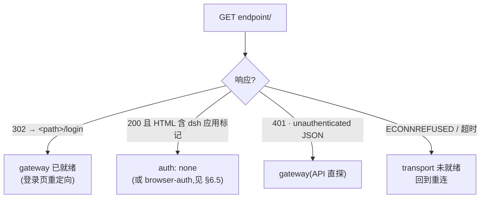
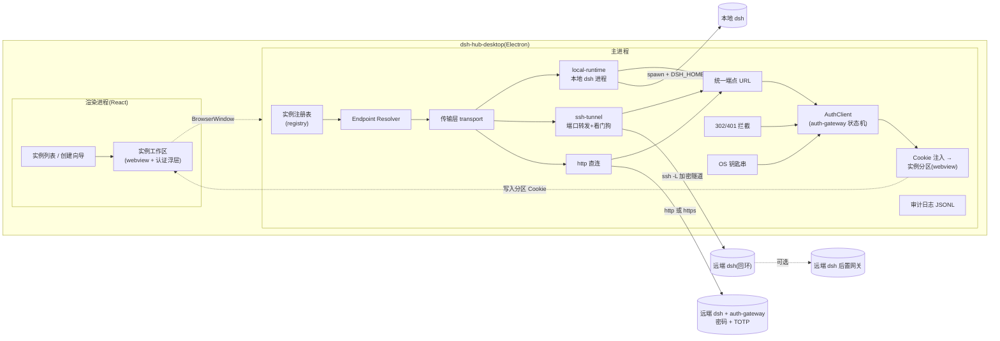
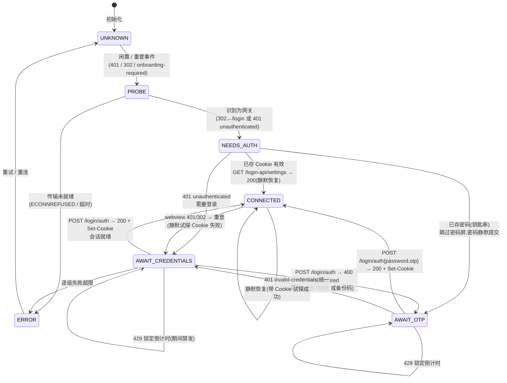

# dsh-hub-desktop 设计方案

> 一个本地独立运行的桌面应用,统一管理多个 dsh 实例:**本地实例**(本机进程)与**远程实例**(SSH 隧道 / 直连 HTTP),远程实例支持 dsh-auth-gateway 的密码 + TOTP 二次验证。
>
> 版本:v0 (设计稿)· 状态:待评审 · 依据:dsh-auth-gateway 源码(本地 checkout)逐行核对

---

## 0. 结论摘要

| 需求 | 方案 | 现有项目 |
|---|---|---|
| 本地独立桌面应用 | Electron 壳(论证见 §3) | ✅ 无现成可复用者,需自建 |
| 多实例管理(本地) | 复用 dsh-launcher 的模型:多版本安装 + 每实例独立 DSH_HOME/profile/端口 | 参考 `dsh-plugins/dsh-launcher` |
| 多实例管理(远程) | **传输 × 认证正交模型**(§2):任意实例 = 一种传输 + 一种认证 | 参考 `Buzzso/dsh-sev`(SSH 隧道),但它是插件且不管理认证 |
| 二次验证(auth-gateway) | 实现完整登录状态机(§5),契约逐条来自网关源码 | **空白,无任何桌面端实现过** |

核心设计决策:**传输层与认证层完全正交**。SSH 隧道只是"把远端端口变成本地端口"的手段,认证客户端对最终解析出的端点 URL 生效。因此:

- 远程实例 = SSH 隧道 + 无认证(**dsh-sev 模式**)
- 远程实例 = SSH 隧道 + auth-gateway(**推荐组合**:远端 dsh 钉在回环,网关是唯一暴露面,桌面端隧道到网关端口)
- 远程实例 = 直连 HTTP(S) + auth-gateway(**纯 HTTP 方案**)
- 本地实例 = 本地进程 + 无认证 / 本地进程 + 网关回环

三种组合都能落在一个统一的实例状态机里,不会出现"SSH 分支改一套、HTTP 分支改一套"的两套逻辑。

---

## 1. 背景与目标

### 1.1 背景

- dsh 官方 CLI 拒绝 `--host 0.0.0.0`,内部 webserver 只在回环监听;远程访问 dsh 只有两条现实路径:
  1. **SSH 隧道**(`ssh -L` 把远端回环端口映射到本地)—— 无应用层认证,安全边界是 SSH;
  2. **进程内认证网关**(dsh-auth-gateway 插件)—— 网关独占对外端口,密码 + TOTP 二次验证,会话 Cookie,防爆破,审计。
- GitHub 现有桌面项目(anywhere-labs、dataelement、dsh-tauri-desk、Minke、DSH-EAC 等)全是"本地单实例壳";多实例启动器(dsh-launcher、PHL、HDSL、EAC-Launcher、ZAT)只管理本地进程;dsh-sev 管远程但只走 SSH 隧道且是插件形态;**没有任何项目对接过 auth-gateway 的登录协议**。

### 1.2 目标用户与场景

| 场景 | 例子 |
|---|---|
| 本地多环境 | 日常开发一个实例、插件测试一个实例、版本尝鲜一个实例,各自独立 DSH_HOME/插件/端口 |
| 远程开发机 | 公司服务器跑 headless dsh(systemd),笔记本通过 SSH 隧道连过去继续会话 |
| 远程 + 二次验证 | 服务器暴露网关端口(密码 + TOTP),任何设备经认证后访问;hub 承担登录状态机与 Cookie 管理 |

### 1.3 非目标(明确不做)

- 不做多用户/多租户(网关 README 已论证单实例下无法真正隔离)——hub 是**单用户**多实例管理器;
- 不做 dsh `--host 0.0.0.0` 直连裸奔实例的"认证"(无网关的远程暴露本身就是安全问题,仅允许显式声明的 `auth: none`,并给出警告);
- 不替代手机远程桥(dataelement 的 LAN mobile bridge 方向相反:手机连桌面);
- 不管理 dsh 版本安装之外的其他运行时(Node 下载等)的完整生态——仅内置 dsh 版本安装,Node 用系统检测或捆绑。

---

## 2. 核心模型:传输 × 认证正交

### 2.1 实例 = `<transport> × <auth>`

```
实例
├─ transport  : 决定"我怎么拿到一个本地可访问的端点 URL"
│   ├─ local    : 本机 spawn dsh 进程(版本隔离目录 + DSH_HOME + profile + 端口)
│   ├─ ssh      : spawn 系统 OpenSSH 客户端,ssh -L 端口转发 + 断线看门狗
│   └─ http     : 直连远程 URL(http/https)
└─ auth        : 决定"端点前的认证怎么过"
    ├─ none        : 无应用层认证(ssh tunnel 安全边界 / 内网信任)
    ├─ gateway     : dsh-auth-gateway 协议(密码 + TOTP + 会话 Cookie)
    └─ browser-auth: dsh 0.1.2+ 内置 BrowserAuth(仅存在于直连回环场景,webview 自认证,§6.5)
```

### 2.2 组合矩阵

| transport \ auth | none | gateway | browser-auth |
|---|---|---|---|
| local | ✅ 本地日常 | ✅ 本机网关回环(测试网关用) | ✅ dsh 自带,webview 自认证 |
| ssh | ✅ dsh-sev 模式 | ✅ **推荐远程形态**(隧到网关端口) | —(隧道目标是回环的话网关优先) |
| http | ⚠️ 显式确认+警告 | ✅ **纯 HTTP 远程形态** | ⚠️ 罕见(远程裸 BrowserAuth),webview 自认证 |

**关键不变量**:`auth` 永远作用在 transport 解析出的**最终端点 URL** 上。SSH 实例解析出的端点是 `http://127.0.0.1:<本地映射端口>`,HTTP 实例解析出的端点是用户给的 URL——认证客户端对两者一视同仁。

### 2.3 自动探测(auth 模式识别)

连接建立后,认证层对端点做一次探测,而非让用户手选模式:



同时支持用户显式覆盖(`authMode: 'gateway' | 'none' | 'auto'`),`auto` 为默认——探测逻辑与登录客户端本身都**依赖同一个约束**:尽力而为,失败可重试,不破坏状态机。

---

### 2.4 总体架构图



---

## 3. 技术选型

### 3.1 外壳:Electron(推荐) vs Tauri(备选)

| 能力需求 | Electron | Tauri 2 |
|---|---|---|
| **往 webview 会话注入/查询 Cookie**(auth-gateway 会话是 HttpOnly Cookie,必须由主进程导入) | ✅ `session.cookies.set/get` | ⚠️ 无等价 API(需自定义协议或代理,复杂且脆弱) |
| **拦截 webview 请求检测 302→/login 与 401**(自动重登触发器) | ✅ `webRequest.onHeadersReceived` | ⚠️ Rust 侧网络栈自行实现 |
| **每实例持久化分区**(cookie 隔离) | ✅ `partition: 'persist:inst-<id>'` | ✅ 勉强(需自定义协议) |
| spawn 并管理 ssh / dsh 子进程、杀进程树 | ✅ Node child_process | ⚠️ 需 Rust sidecar 或 Node 侧车 |
| 生态先例(anywhere-labs、dataelement、Minke 均验证过) | ✅ | dsh-launcher(本地管理,无 cookie 需求) |

**决策:Electron**(>= 28,LTS Node 20+)。理由:auth-gateway 集成(§5、§6)强依赖主进程 Cookie 控制与请求拦截,这两点是 Electron 一等公民能力。**约束**:核心逻辑(registry / transport / auth client)写成框架无关的纯 TypeScript 模块,未来如需瘦身可移植到 Tauri。

### 3.2 技术栈

- **框架**:Electron + React 18 + TypeScript(strict)+ Vite
- **状态**:zustand(实例状态机) + 主进程事件总线(`ipcRenderer.on('instance:status')`)
- **持久化**:实例注册表 JSON(原子写 + 滚动 `.bak`,沿用 dsh-sev 验证过的模式);密码/敏感项进 OS 钥匙串(见 §7)
- **HTTP 客户端**:主进程 `undici`(Node 内建 fetch),Cookie 手动管理(绝不落地 localStorage)
- **SSH**:系统 OpenSSH 二进制(§4.2 论证),无 Node SSH 库依赖
- **测试**:Vitest(单测)+ Playwright `_electron`(E2E)+ 契约测试(真实网关,§8)

### 3.3 项目结构

```
dsh-hub-desktop/
├─ docs/                          # 本方案 + 后续决策记录
├─ src/
│  ├─ main/                       # Electron 主进程
│  │  ├─ registry/                # 实例注册表(CRUD/磁盘/校验)
│  │  ├─ transport/
│  │  │  ├─ local-runtime.ts      # dsh 版本安装 + 进程 spawn/杀树
│  │  │  ├─ ssh-tunnel.ts         # ssh -N -L 生命周期 + 看门狗
│  │  │  ├─ http-endpoint.ts      # 直连 URL 校验/探测
│  │  │  └─ endpoint-resolver.ts  # transport → 最终端点 URL
│  │  ├─ auth/
│  │  │  ├─ gateway-client.ts     # auth-gateway 协议客户端(§5 契约)
│  │  │  ├─ gateway-state.ts      # 登录状态机(§5.3)
│  │  │  └─ detect.ts             # §2.3 探测
│  │  ├─ webview/
│  │  │  ├─ window-host.ts        # 每实例分区窗口/页签
│  │  │  ├─ cookie-import.ts      # 主进程登录 Cookie → 分区
│  │  │  └─ intercept.ts          # 302/401 拦截 → 重登信号
│  │  ├─ vault/                    # 钥匙串封装
│  │  └─ audit/                    # JSONL 审计日志
│  ├─ preload/                    # contextBridge 白名单 API
│  └─ renderer/                   # React UI(实例列表/向导/登录面板/页签)
├─ tests/
│  ├─ unit/                       # auth 状态机、registry、探测
│  ├─ contract/                   # 对真实 auth-gateway 的契约测试
│  └─ e2e/                        # Playwright _electron
└─ scripts/                       # 测试栅栏:起真实网关实例的工具
```

---

## 4. 传输层

### 4.1 本地实例(local)

复用 dsh-launcher 验证过的模型:

1. **版本安装**:按版本把 `@deepseek-ai/dsh` npm 包装进隔离目录(`runtimes/dsh-<version>/`),版本间零干扰;列表来自 npm registry(sorted by versions)。
2. **实例配置**:每实例 `{ name, version, dshHome, profile, port, envOverrides }`。DSH_HOME 三种模式:复用系统 `~/.dsh` / 实例专属 `hub-data/homes/<id>/` / 用户指定。
3. **启动**:注入 `DSH_HOME` 与 env 覆盖,spawn `node <runtime>/lib/bin.js web --profile <p> --port <port>`,解析 stdout 打印的就绪 URL,健康检查通过后开页签。
4. **停止**:杀整个进程树(包装 shell + 子进程),退出时清理孤儿进程。

### 4.2 SSH 隧道(ssh)

**选型:调用系统 OpenSSH 二进制**,而非 Node 的 ssh2 库:

- macOS / Linux 自带;Windows 10+ 内置 OpenSSH 客户端(可选功能,安装器可检测并提示);
- 天然获得 `~/.ssh/config` 别名、ssh-agent、known_hosts、ControlMaster 复用等成熟能力;
- ssh2 纯 JS 实现拿不到这些(agent/密钥编排要重造)。

**spawn 参数**(全部显式,不依赖用户全局配置漂移):

```bash
ssh -N -L <localPort>:127.0.0.1:<remotePort> \
    -p <sshPort:22> [ -i <identityFile> ] [ -l <user> ] \
    -o ExitOnForwardFailure=yes \
    -o ServerAliveInterval=15 -o ServerAliveCountMax=3 \
    -o ConnectTimeout=10 \
    -o ControlMaster=auto -o ControlPath=<hub>/ssh/inst-<id>.sock \
    -o StrictHostKeyChecking=yes \
    -o UserKnownHostsFile=<hub>/ssh/known_hosts \
    <host|alias>
```

| 参数/行为 | 理由 |
|---|---|
| `-N` | 只做转发,不开远程 shell |
| `ExitOnForwardFailure=yes` | 端口绑定失败立即退出,便于看门狗归因(而不是挂起) |
| `ServerAliveInterval/CountMax` | 15s 心跳、3 次失联判死——比 TCP 超时快得多 |
| `ControlMaster=auto` | 同一实例的并发连接(探测、webview)复用一条 SSH 连接 |
| `StrictHostKeyChecking=yes` + `UserKnownHostsFile=<hub>/ssh/known_hosts` | **TOFU(T5 起)**:先 `ssh-keyscan` 预取指纹 → UI 展示确认 → 写入 hub 私有 known_hosts 才放行;指纹变化拒绝并告警(§7.3)。绝不写入用户 `~/.ssh` |
| 密钥 | 优先 ssh-agent;无 agent 时用 `-i` 指定密钥;需要口令时经 **askpass 钩子**弹 UI 输入(瞬时,不落盘) |

**别名模式**:`host` 字段也可以是 `~/.ssh/config` 别名(dsh-sev 用户习惯),此时联动参数全不填。

**密钥解析预览**:对目标执行 `ssh -G <host|alias>` 解析实际生效的 `IdentityFile`(覆盖 config 别名/默认路径/指定 `-i`),`ssh-add -L` 列 agent 可用密钥;向导与详情页只读展示「将使用密钥」与 agent 状态(见实现计划 T5)。只读元信息,不读取私钥内容——复用本机密钥(agent/默认路径)是默认行为,零配置。

**端口管理**:本地映射端口由 hub 集中分配(默认从 30000 起,冲突则递增),持久化在实例记录里;健康检查要用真实 HTTP 探测(见 §4.3),不能只信进程存活。

**看门狗**(核心健壮性):

```
ssh 进程退出(任何原因)
  → 归因:exit code / stderr 特征(forward failure、auth failed、conn refused…)
  → 指数退避重连:1s → 2s → 4s → … → 上限 30s
  → 稳定运行 ≥ 60s 后重置退避
  → 每次状态变化推送给 UI 与审计日志
```

### 4.3 端点到健康探测

任何传输解析出的端点,统一用同一套 **HealthyProbe**:

- `GET <endpoint>/` ,任意 HTTP 响应(200/302/401)即"传输就绪";`ECONNREFUSED`/超时 = 未就绪;进程退出 = 传输死亡。
- 认证层随后再区分 302→/login(网关)与 200(无认证)。
- 探测频率:连接期 500ms;稳固期 30s;SSH 断线由看门狗主导,探测只负责确认"转发真的在工作"。

---

## 5. 认证层:dsh-auth-gateway 协议契约

> **本章全部字段与行为均逐条核对自网关源码**(`lib/gateway.js` / `lib/auth.js` / `lib/gateway-otp.js` / `lib/errors.js`),目标是让 hub 的客户端与网关的浏览器端页面行为完全一致。

### 5.1 会话与 Cookie

| 项 | 值 | 来源 |
|---|---|---|
| Cookie 名 | `dsh_auth` | `auth.js` `COOKIE_NAME` |
| 值 | 256-bit 随机 token,hex 64 字符 | `SessionStore.issue()` |
| 属性 | `Path=/; HttpOnly; SameSite=Strict; Max-Age=2592000`(30 天) | `auth.js` set-cookie 生成 |
| 无 `Secure` 标志 | **纯 HTTP 可用**——LAN/隧道场景没有 TLS 也能登录(数据面安全由隧道/网络层负责) | 同上 |
| 会话存储 | **网关进程内存**;dsh 重启 = 全员登出;改密 = 全员吊销 | `SessionStore`注释 |

**对 hub 的含义**:Cookie 必须在主进程持久化(可选,§7.2),"30 天不过期"对网关进程重启不成立——客户端必须以 401 `unauthenticated` 为准触发重登,而不是信任本地 Cookie 的 Max-Age。

### 5.2 端点与请求契约

所有 POST 均为 JSON(`Content-Type: application/json`),响应 JSON;`basePath` 存在时所有端点前缀 `/<basePath>`。

#### 认证入口

| 端点 | 请求体 | 成功 | 失败 |
|---|---|---|---|
| `POST /login/auth` | `{ password, otp?, backupCode? }` | `200 {ok:true}` + `Set-Cookie: dsh_auth=...` | 见下表 |
| `POST /otp/verify` | `{ otp }`(6 位,会话已存在但 OTP 未验) | `200 {ok:true}`(无新 Cookie) | 见下表 |
| `POST /otp/verify-backup` | `{ code }`(备份码,同上) | `200 {ok:true}` | 见下表 |
| `POST /login/logout` | `{}` | `200` + 过期 Cookie | — |
| `POST /login/change` | `{ oldPassword, newPassword }` | `200` + 过期 Cookie(会话全吊销) | 见下表 |
| `GET /login-api/settings` | —(需已认证会话) | `200 {ok:true, config:{'dsh-auth-gateway':{otpEnabled, otpStatus, otpIssuer, otpPeriod, otpDigits, otpWindow,…}}}` | 401 |
| `GET /login-api/version` | —(需已认证会话) | `{ok:true, version, repo,…}` | 401 |

> **五件关键事实**(源码核实):
> 1. **单次请求可完成 2FA**:OTP 启用时 `/login/auth` 直接接受 `{password, otp}` 或 `{password, backupCode}`,一次 200 即签发"完全验证"会话(hub 优先用这条路,避免两步握手);
> 2. **错误码统一**:密码/OTP/备份码错误一律 `401 {ok:false,error:'invalid-credentials'}`,客户端**不得**据此区分错误类型,只能提示"账号或验证码错误"(网关刻意防凭据枚举);
> 3. OTP 启用但未带码 → `400 {ok:false,error:'otp-required'}`——这是客户端进入 TOTP 提问的**权威信号**;
> 4. 会话门禁:`/api/*` 未认证 → `401 {ok:false,error:'unauthenticated'}`(JSON);页面 → `302 → /login`;WebSocket 升级未认证 → 直接销毁连接;
> 5. onboarding 未完成 → `/api/*` 返回 `401 {ok:false,error:'onboarding-required'}`,页面 302 → `/onboarding`;**设置新密码走的正是 `POST /login/change`,oldPassword=初始密码**(onboarding 表单源码核实)。

#### 失败响应全集(客户端必须处理的)

| 状态码 | `error` 字段 | 客户端动作 |
|---|---|---|
| 400 | `otp-required` | 弹 TOTP/备份码输入,带同一次密码重发 `/login/auth` |
| 400 | `invalid-otp` / `otp-not-enabled` / `bad-payload` / `invalid-json` / `invalid-backup-code` | 输入错误提示,重置对应输入框 |
| 400 | `password-too-short` / `password-too-simple` / `password-mismatch` | 改密强度校验失败提示(强度规则:≥8 位,含大小写或特殊字符) |
| 401 | `invalid-credentials` / `unauthenticated` | 凭据错误 / 会话失效→重登 |
| 429 | `rate-limited`(全局 60 次/分 或 OTP 10 次/分) | 提示"尝试过于频繁",客户端退避 ≥30s |
| 429 | `too-many-attempts` + `retryAfterSeconds`(5 次失败锁 5 分钟) | **必须在 UI 显示锁定时长倒计时,期间禁止再发认证请求** |
| 500 | `otp-secret-missing` 等 | 提示实例配置异常,联系管理员 |
| 413 | `payload-too-large`(1MB 上限) | 不应发生(客户端请求 < 1KB),防御性处理 |

**(客户端纪律)**:登录尝试**串行**、无后台重试风暴;每个实例独立的退避控制器;429/锁定的 `retryAfterSeconds` 是唯一计时依据;多实例并行登录时全局节流(默认上限 2 次并发认证)。

### 5.3 登录状态机(AuthClient)



**已存密码直达验证码(2026-09-15 已决)**:钥匙串中存在该实例密码(用户曾勾选「记住密码」)时,状态机从 `NEEDS_AUTH` 直接进入 `AWAIT_OTP`——密码不经过 UI,随 `POST /login/auth {password, otp}` 静默提交;统一 401 则回退 `AWAIT_CREDENTIALS` 展示密码屏(不暴露密码错还是码错);已存密码不因失败自动清除,引导用户在详情/设置主动清除。**分步(password→otp→backup)是唯一 UI 形态,不做密码+验证码同屏输入**——协议支持单请求提交,但对 UX 无增益。

**OTP 与会话**:优先"单次请求带码"路径;只有当服务端在**已有会话**上要求补验(401 `otp-required`)时才走 `/otp/verify` / `/otp/verify-backup`(会话挂起态)。绑定/禁用 OTP 不在 hub 首版范围(用户可在实例 Web UI 内完成),但 `GET /login-api/settings` 的 `otpEnabled` 状态用于向 UI 展示"该实例启用了二因素"。

### 5.4 会话就绪与 Cookie 生命周期

```
登录成功 → Cookie(dsh_auth) 存于:
  1. 主进程 AuthClient 的 Cookie 罐(内存,本次运行)
  2. (可选)OS 钥匙串 → hub 重启后自动尝试静默重登
  3. webview 分区 cookie(§6.2)→ 页面/WS 请求自动携带
```
- 重登时:先带已存 Cookie 探 `GET /login-api/settings`,200 直接复用,不给用户弹窗;
- 会话失效信号:webview 主文档 302→/login、任一 `/api/*` 401、WS 断开重连被拒——按 §6.3 拦截,然后走状态机。

---

## 6. Webview 集成

### 6.1 每实例隔离

- `partition: 'persist:inst-<instanceId>'`:Cookie、缓存、Service Worker 按实例隔离,互不串味;
- `nodeIntegration: false`、`contextIsolation: true`、`sandbox: true`;禁弹窗、禁新窗口导航到外域(`setWindowOpenHandler`);
- 每个实例一个窗口或页签(首版:窗口,后续可合并为页签),关闭 = 断开连接(本地实例停止进程,SSH 断隧道,可选)。

### 6.2 Cookie 导入(主进程 → 分区)

登录由**主进程**完成(§5.3),成功后把 Cookie 写入该实例分区:

```ts
await ses.cookies.set({
  url: `${endpoint.origin}${basePath || '/'}`,
  name: 'dsh_auth',
  value: token,
  httpOnly: true, sameSite: 'strict',
  path: '/', secure: false,          // 网关 Cookie 无 Secure 标志
  expirationDate: now + 30d,         // 与网关 Max-Age 一致(会话真失效以 401 为准)
})
```

- 写成功后 `webContents.loadURL(endpoint + basePath + '/')`,页面与 WebSocket 自动带 Cookie(Chromium 对 WS 握手同样携带分区 Cookie);
- **注意**:Cookie 由主进程注入而非 webview 表单自动填——避免页面 DOM 依赖,也避免把密码暴露给渲染进程。

### 6.3 401/302 拦截(自动重登触发器)

`session.webRequest.onHeadersReceived` 只监视**导航与主文档**请求:

```ts
if (statusCode === 302 && location 指向 <basePath>/login)     → 会话失效事件
if (statusCode === 401 && JSON.error ∈ {unauthenticated, otp-required, onboarding-required}) → 对应事件
```

收到事件后:暂停页签(显示覆盖层),AuthClient 带已存 Cookie 静默试探;失败 → 弹认证面板(密码 / TOTP / 备份码 / 改密引导按状态机分支)。**WS 断开不作为重连判定依据**(网关 README 注明 WS 无限重连是常态),以 401/302 为准。

### 6.4 basePath 支持

实例可配 `basePath`(如 `/dsh`);Cookie 仍为 `Path=/`(网关源码核实,basePath 不改变 Cookie 路径);webview 加载 `endpoint + basePath + '/'`;拦截逻辑识别 `/login` 相对路径即可。

### 6.5 browser-auth 模式(直连无网关时的 dsh 内置认证)

只有当 `auth: none` 的实例是 **dsh 0.1.2+ 且 webview 直连其回环**(如本地实例未装网关)时,webview 会遇到 dsh 内置 BrowserAuth 页面——此时让 **webview 自认证**(会话 Cookie 留在分区内即可,无需主进程参与)。探测规则:页面出现 BrowserAuth 登录面 → 标记该实例 `browserAuth: true`,状态机只做"页面就绪"判定。此模式对远程直连默认不启用(远程必须显式确认)。

---

## 7. 凭据与安全

### 7.1 威胁模型(简版 STRIDE)

| 威胁 | 场景 | 缓解 |
|---|---|---|
| S 冒认 | 有人拿到 hub 数据目录 | 敏感项只进 OS 钥匙串;注册表仅存非敏感配置 |
| S 冒认(远程) | 登录凭据被中间人截获 | 直连 HTTP 远程实例默认警告"数据面明文";SSH 模式数据面加密;HTTPS 直连强校验(禁关证书检查) |
| T 篡改 | 实例注册表被改 | 原子写 + 滚动备份;注册表条目 schema 校验 |
| I 泄露 | webview 里实例 A 数据被实例 B 读 | 每实例独立 partition;主进程 Cookie 不落入渲染进程 |
| I 泄露 | 日志泄漏凭据 | 审计日志只记事件/来源/结果,**严禁记录密码、OTP、Cookie** |
| D 拒绝服务 | 客户端认证风暴把网关锁死(全局 60/min 是共享预算) | §5.2 客户端纪律:串行、退避、锁定倒计时 |
| E 提权 | 恶意插件页面读主进程 | contextIsolation + 白名单 preload API;webview 不可用 Node |

### 7.2 凭据存储策略(vault)

| 存储项 | 默认行为 | 可选项 |
|---|---|---|
| 网关密码 | **不进钥匙串**(每次输入/会话期内存) | 用户勾选"记住密码"→ OS 钥匙串(safeStorage 加密) |
| 会话 Cookie `dsh_auth` | 内存;重启后自动重登失败再弹登录 | 用户勾选"记住登录态" → 钥匙串,重启静默复用 |
| TOTP 密钥 | **永不存储**——密钥在用户自己的认证器里,输入即用即弃 | — |
| SSH 口令/密钥口令 | 瞬时 askpass 弹窗,不落盘 | 勾选后进钥匙串 |
| SSH 私钥 | 不复制,只用路径引用;优先 ssh-agent | — |

> 安全默认:"会话态优先、密钥态可选",任何持久化都要用户显式勾选,并在实例详情里可一键清除。

#### 7.2.1 已知限制:Chromium 分区存储会落盘会话 Cookie(T12 走查决策)

**实测事实**(Electron 43.7,未签名开发构建):实例窗口使用 `partition: persist:inst-<id>`
(§6.1 要求每实例隔离),而 Chromium 会把该分区收到的 Cookie 写进
`<userData>/Partitions/inst-<id>/Cookies`。对该 SQLite 库的检查显示
`dsh_auth` 的值**以明文保存**(`length(encrypted_value)=0`),且与用户是否勾选
「记住登录态」**无关**——也就是说,上表「会话 Cookie:内存」描述的是**本应用的保险库**,
并不覆盖 Chromium 自己的分区存储。UI 文案因此已改为只承诺「不存入保险库」。

**决策:接受该风险,记录在案(而非默认沉默)**。理由:

1. 暴露面受限——分区按实例隔离;`window-host-policy.ts` 把窗口内导航限制在回环 + 同端口,
   该分区不会被带到外部 origin;数据落在用户自己的 `userData` 下,与 dsh 自身
   `$DSH_HOME` 的凭据同级;
2. `dsh_auth` 是用户自己配置的网关会话令牌,同一台机器上 dsh 与网关本就持有等价材料;
3. 「不落盘」的强保证已由保险库覆盖(未勾选即拒绝写入、密文 0600、降级绝不落盘)。

**缓解措施**:① UI 文案已限定承诺范围(不再宣称「凭据不会写入磁盘」);
② 登出/删除实例会清分区会话 Cookie(`clearPartitionSession`),缩短残留窗口。

**后续项(未排期,记录以备评审)**:更彻底的方案是「按勾选决定分区是否持久化」——
未勾选「记住登录态」时使用**非持久分区**(`inst-<id>`,内存态),勾选时才用
`persist:inst-<id>`;代价是切换后旧分区目录成为孤儿需要清理,且关闭实例窗口会丢失
未勾选用户的会话(需重新登录),属于需要真实 UI 验证的 UX 取舍。

### 7.3 SSH 主机密钥(TOFU)

- `StrictHostKeyChecking=yes`（T5 起：TOFU 前置完成后再放行） + 首次连接时在 UI 展示主机指纹,**用户确认后才让连接真正建立**(先 `ssh-keyscan` 预取指纹展示,再放行);
- known_hosts 使用 hub 私有文件(`hub-data/ssh/known_hosts`),不污染系统文件;
- 指纹变更一律拒绝连接并告警(不自动清理)。

### 7.4 HTTP(S) 直连约束

- 仅允许 `http://`/`https://`;URL 中禁止内嵌凭据(userinfo)与查询串密钥,发现即拒绝;
- `https` 严格校验证书(TLS 1.2+,系统 CA + 用户可导入自建 CA);私网/非 TLS 端点属**显式受支持**场景(这是远程实例管理器的本职),但 UI 必须标注"未加密连接";
- SSRF 边界说明:本工具的设计意图就是连接任意远程端点,因此不做域名层白名单;防御重心放在 §7.2–7.3 的凭据与密钥面。

### 7.5 审计日志

`hub-data/audit/audit.log`(JSONL,按天轮转,保留 90 天,镜像网关风格):
每次 {实例, 事件: connect/disconnect/ssh-exit/ssh-reconnect/login-success/login-failed/rate-limited/lockout/session-revoked/cookie-cleared, 时间, 结果码};**不记录任何凭据内容**。

---

## 8. 测试策略

| 层 | 内容 | 工具 |
|---|---|---|
| 单元 | auth 状态机(每张表 §5.2 每条错误路径)、registry CRUD、探测判定、退避控制器、Cookie 导入参数 | Vitest |
| 契约 | **对真实 auth-gateway 的端到端契约**:测试栅栏脚本 `scripts/gateway-fixture.mjs` 在临时 profile 安装网关并启动 `dsh web`,跑全流程:登录 → OTP 启用(用受控 TOTP secret)→ 登录失败锁定(改配置缩短窗口)→ 429 退避 → 会话失效 → onboarding(初始密码→login/change)→ basePath 形态 | Vitest + 真实实例 |
| 传输 | 本地 127.0.0.1 sshd(次选端口)起隧道打到测试 HTTP 服务器:断线重连(杀 sshd 侧进程)、退避、端口冲突、ExitOnForwardFailure | Vitest |
| E2E | Playwright `_electron`:创建三种实例、登录面板交互、webview 就绪、401 时覆盖层出现、重登成功 | Playwright |

**关键工具**:`gateway-fixture` 里用 `DSH_AUTH_GATEWAY_MASTER_KEY` 环境变量注入固定主密钥,使 OTP 密钥可预测完成端到端 2FA 契约测试。

---

## 9. 里程碑

| 阶段 | 内容 | 验收出口 |
|---|---|---|
| M1 骨架+本地 | Electron 壳、注册表、本地实例(版本安装/spawn/杀树)、页签 | 能创建/启动/停止 2 个本地实例 |
| M2 传输层 | SSH 隧道 + 看门狗 + 探测;HTTP 直连端点 + 校验 | SSH 断线 30s 内自动恢复,无孤儿进程 |
| M3 认证层 | AuthClient 全状态机 + Cookie 导入 + 302/401 拦截 + 认证面板 | 对真实网关完成 §8 契约全绿 |
| M4 加固打磨 | vault、审计、TOFU UI、锁定倒计时、i18n(zh/en)、托盘 | 安全清单(§7)逐项过审 |
| M5 发行 | 代码签名、NSIS/DMG、自动更新 | 双平台安装包可用 |

并行性:M1 与 M2 的"传输层"可并行设计但不能并行实现(M2 依赖 M1 的注册表);M3 依赖 M2 的 endpoint-resolver,但其**契约测试**可与 M1 并行开发(纯 HTTP 打真实网关)。

---

## 10. 开放问题(评审时确认)

1. **窗口 vs 页签**:首版多窗口(每实例一窗口)是否可接受?页签容器工作量约 +2d。
2. **记住密码/Cookie 的默认值**:默认全部不入钥匙串(每次登录),还是 Cookie 默认记住、密码默认不记?
3. **本地实例的 DSH_HOME 默认策略**:复用 `~/.dsh`(与系统 dsh CLI 共享)还是实例专属隔离为默认?
4. **Windows 无 OpenSSH 客户端**的处理:检测缺失时引导安装,还是退回内置 ssh2 备选通道?(建议:引导安装,不做双实现)
5. 是否需要把绑定/禁用 TOTP、改密流程直接做进 hub(而非引导用户在 Web UI 完成)?——首版建议后者。